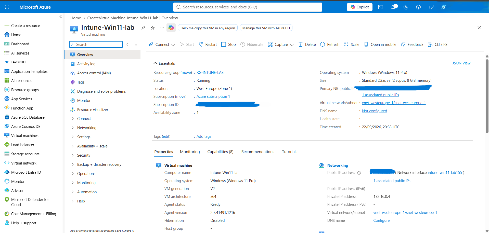

Day 1 - Microsoft Intune Lab Environment Setup

Overview

Day 1 focused on building the Windows 11 cloud environment that will be used throughout the Microsoft Intune endpoint management lab.

I created the Azure virtual machine, configured the security features required for a modern Windows endpoint, connected to the machine through Remote Desktop and established the technical foundation for the later Entra ID and Intune stages.

1. Creating the Windows 11 Azure Virtual Machine

I started by creating a dedicated Windows 11 virtual machine in Microsoft Azure for the Intune lab.

The lab VM was configured with:

- VM name: `Intune-Win11-lab`
- Operating system: Windows 11 Pro 25H2
- Architecture: x64
- VM size: Standard D2as v7
- Region: West Europe
- Security type: Trusted Launch
- Secure Boot: Enabled
- vTPM: Enabled

What I learned: Using a dedicated virtual machine gives me an isolated Windows endpoint where I can test enrollment, policies and security settings without affecting a production device.

2. Verifying the Lab Virtual Machine

After deployment, I checked the Azure virtual machine and confirmed that the Windows 11 lab endpoint had been created successfully.

This machine will act as the managed Windows endpoint throughout the project.

What I learned: Before beginning endpoint-management work, the underlying device needs to be available, correctly configured and accessible.

3. Connecting to the Windows 11 VM Through RDP

I connected to the Windows 11 virtual machine using Remote Desktop Protocol.

Successful RDP access confirmed that the virtual machine was running and that I could administer the Windows endpoint remotely.

What I learned: Remote access is important in a cloud lab because it allows me to configure and troubleshoot the endpoint directly while the infrastructure remains hosted in Azure.

4. Preparing for Microsoft Intune

With the Windows 11 endpoint running, I reviewed the next requirements for bringing the device under Microsoft Intune management.

The planned next stages were:

- Prepare Microsoft Entra ID users and groups
- Verify the available Intune licensing and management access
- Connect the Windows endpoint to the lab tenant
- Enroll the endpoint into Microsoft Intune
- Confirm successful management
- Begin compliance, configuration and endpoint security testing

At this stage I had not yet confirmed successful Intune licensing or enrollment. Those checks continued during the later stages of the project.

This distinction is important because creating an Azure Windows VM does not by itself mean that the device is enrolled in or managed by Microsoft Intune.

5. Day 1 Outcome

By the end of Day 1 I had:

- Created the Windows 11 Azure lab virtual machine
- Configured Trusted Launch
- Enabled Secure Boot and vTPM
- Verified the virtual machine after deployment
- Successfully accessed Windows 11 through RDP
- Established the endpoint foundation for the Intune lab

Day 1 Status

Azure Windows 11 VM: Ready  
Trusted Launch: Configured  
Secure Boot: Enabled  
vTPM: Enabled  
RDP access: Working  
Entra ID preparation: Pending  
Intune licensing/management access: Pending verification  
Intune enrollment: Pending

Day 1 established the Windows endpoint and Azure infrastructure required for the rest of the project. The next stages build on this foundation by preparing identity, troubleshooting connectivity and enrollment, and verifying the environment before Intune policy deployment.

References and Further Reading

Official Microsoft documentation relevant to the technologies and procedures demonstrated in this lab:

- [Azure Windows Virtual Machines](https://learn.microsoft.com/en-us/azure/virtual-machines/windows/)
- [Trusted Launch for Azure virtual machines](https://learn.microsoft.com/en-us/azure/virtual-machines/trusted-launch)
- [Role-based access control for Microsoft Intune](https://learn.microsoft.com/en-us/intune/intune-service/fundamentals/role-based-access-control)
