Day 2 - Azure Windows VM and Intune Enrollment Troubleshooting

Overview

Today I continued my Microsoft Intune lab. I worked on the Windows VM in Azure, connected to it remotely and started preparing it for Intune.

I also started practising PowerShell. I used the commands to check the VM and help me understand what was working while I was troubleshooting.

1. Intune Trial and Lab Environment

I started the Microsoft Intune Plan 1 trial sign-up for my separate lab environment.

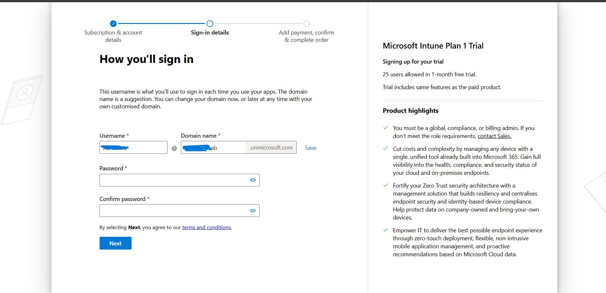

What I learned: Using a separate lab account means I can practise without affecting a real business environment.

2. Azure Resource Group and Windows VM

I used the Azure Resource Group:

`RG-Intune-Lab`

and created the VM:

`Intune-Win11-lab`

The VM is the Windows test device I am using for this Intune project.

My first deployment attempt had a region restriction. After changing the Azure region, the deployment completed.

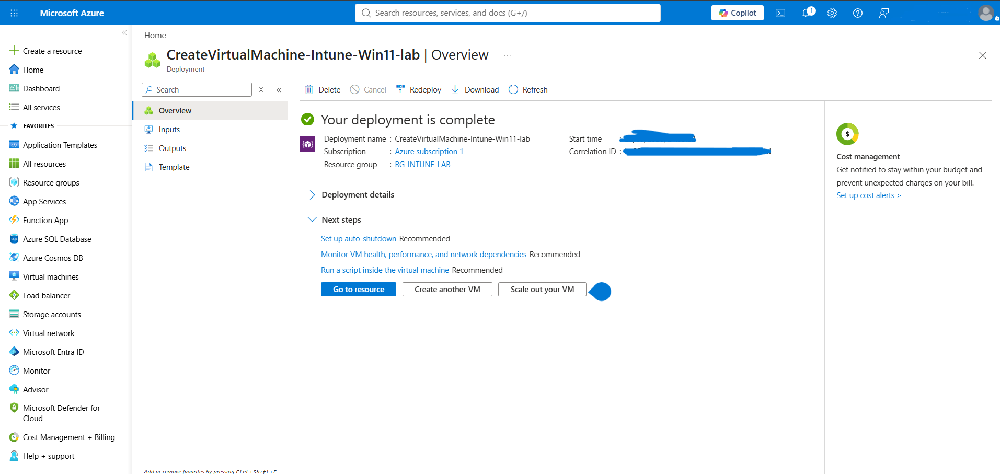

I then checked the VM from the Azure portal.


What I learned: If an Azure deployment fails, the problem is not always the VM settings. The selected Azure region can also be the cause.

3. First PowerShell Check

I started learning PowerShell by checking basic information about the VM.

```powershell
Get-ComputerInfo | Select-Object WindowsProductName, WindowsVersion, OsArchitecture, CsName
```

My first attempt failed because I entered the PowerShell command in Command Prompt.

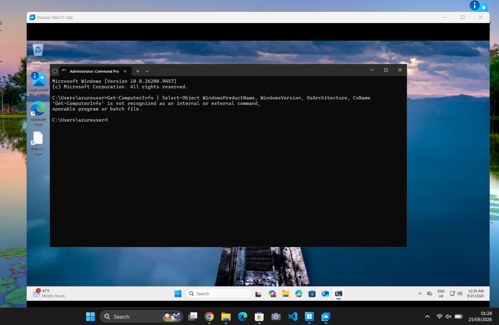

I learned that `Get-ComputerInfo` is a PowerShell command, switched to PowerShell and ran it again successfully.


Purpose: Check the Windows information, system type and computer name.

What I learned: Command Prompt and PowerShell are different. Some commands only work in PowerShell.

4. RDP Connection Troubleshooting

I tried connecting to the VM using Windows App / Remote Desktop.

At first I used the VM name:

`Intune-Win11-lab`

The connection failed because the computer name could not be found.

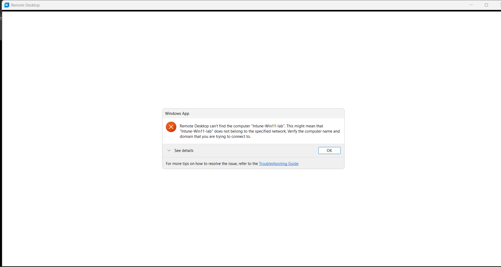

I went back to Azure and used the VM connection information instead.

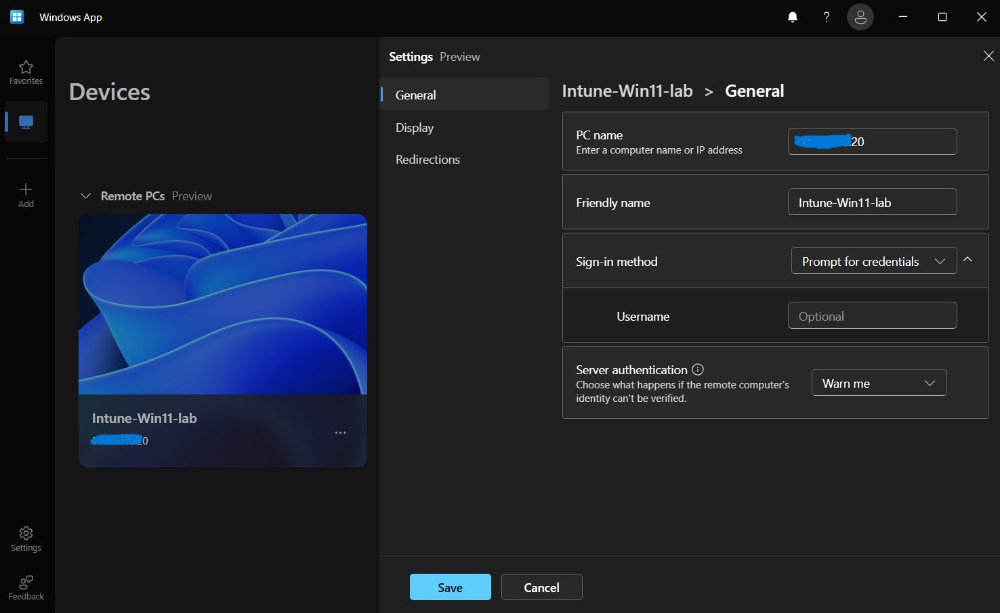

I also encountered a credential error while testing the RDP connection.

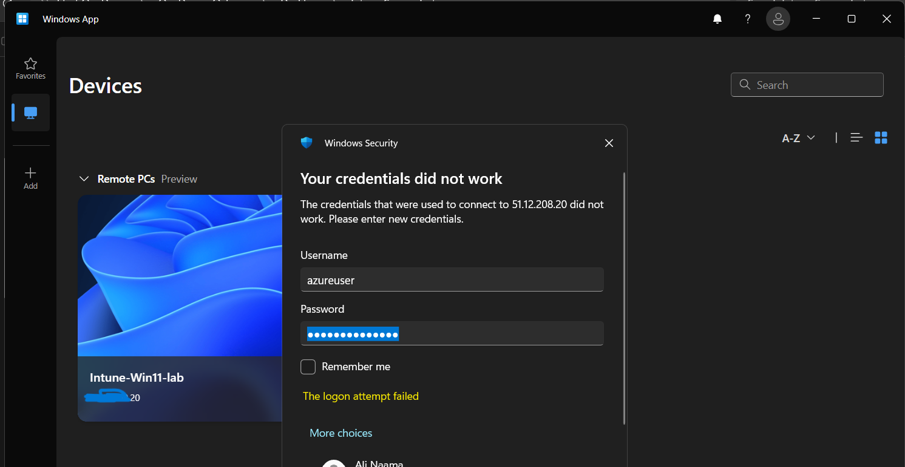

I returned to the Azure RDP connection page to check the connection details and username.

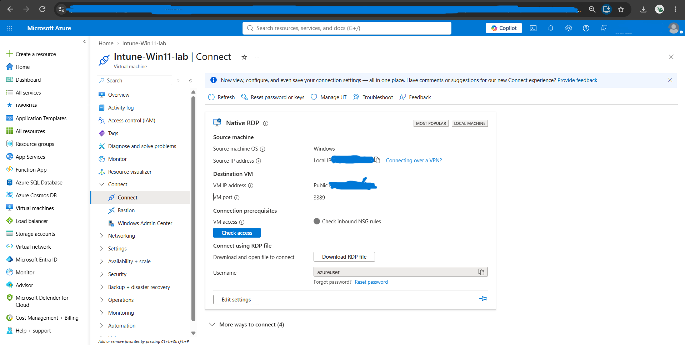

What I learned: When RDP does not work, I need to check the address being used and the login details instead of repeatedly trying the same connection.

5. Checking the VM Network

After getting access to the VM, I used PowerShell to look at its network settings.

```powershell
Get-NetIPConfiguration
```

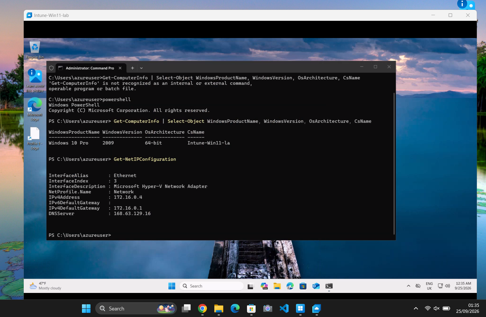

This showed me the Ethernet connection, private IP address, gateway and DNS server.

I then checked whether the network adapter was active.

```powershell
Get-NetAdapter | Select-Object Name, InterfaceDescription, Status, LinkSpeed
```

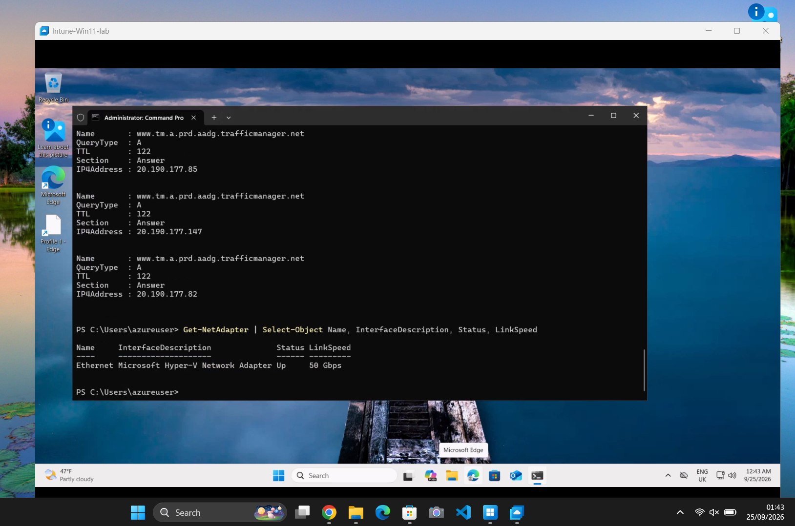

The network adapter showed `Up`.

What I learned: I can use PowerShell to check the network settings and whether the network adapter is working.

6. Checking Microsoft Connectivity

I tested whether the VM could connect to Microsoft's sign-in service on port 443.

```powershell
Test-NetConnection login.microsoftonline.com -Port 443
```

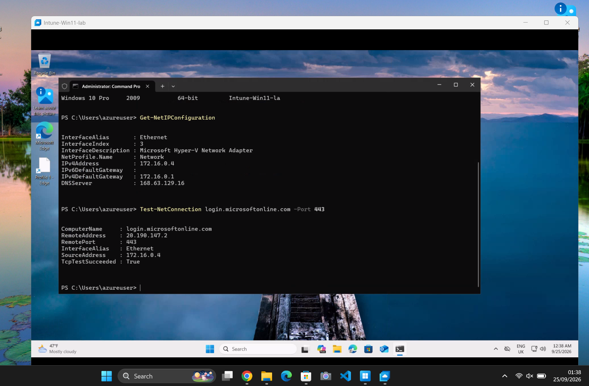

The test returned:

`TcpTestSucceeded : True`

I also checked whether DNS could find the Microsoft sign-in address.

```powershell
Resolve-DnsName login.microsoftonline.com
```

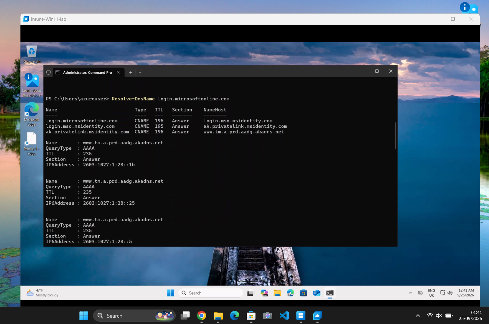

The command returned Microsoft addresses, so the DNS lookup was working.

What I learned: I learned how to check if DNS is working and whether the VM can connect to a Microsoft service.

7. Connected the Work Account

Inside the Windows VM I opened:

`Settings > Accounts > Access work or school`

I connected my lab account.

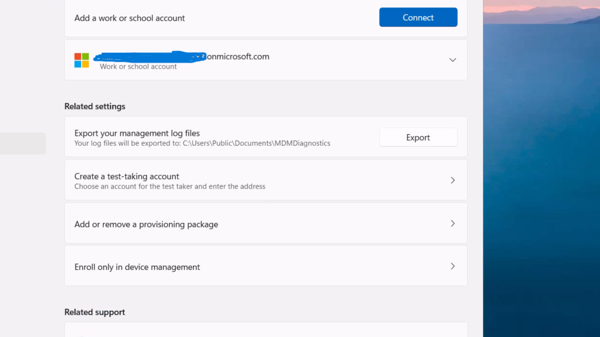

What I learned: Connecting the work account does not automatically mean the device is fully enrolled in Intune.

8. Intune Enrollment Attempt

I then attempted to enroll the Windows VM into device management.

Windows could not automatically discover the management endpoint.

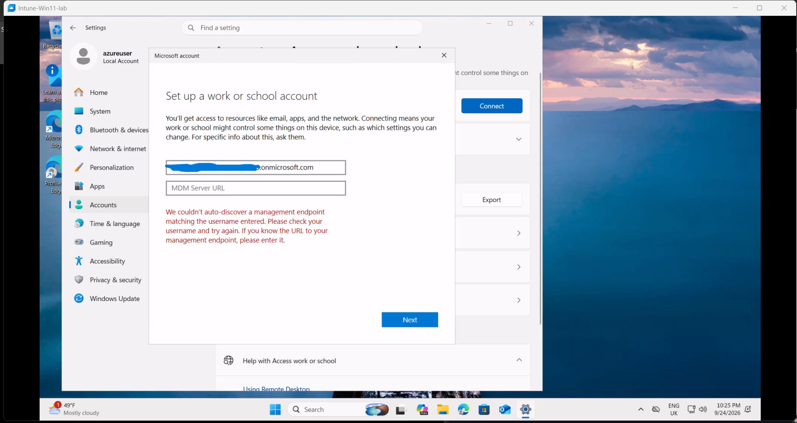

Instead of changing random settings, I checked what was working first.

I tested whether the VM could reach the Intune enrollment service on port 443.

```powershell
Test-NetConnection enrollment.manage.microsoft.com -Port 443
```

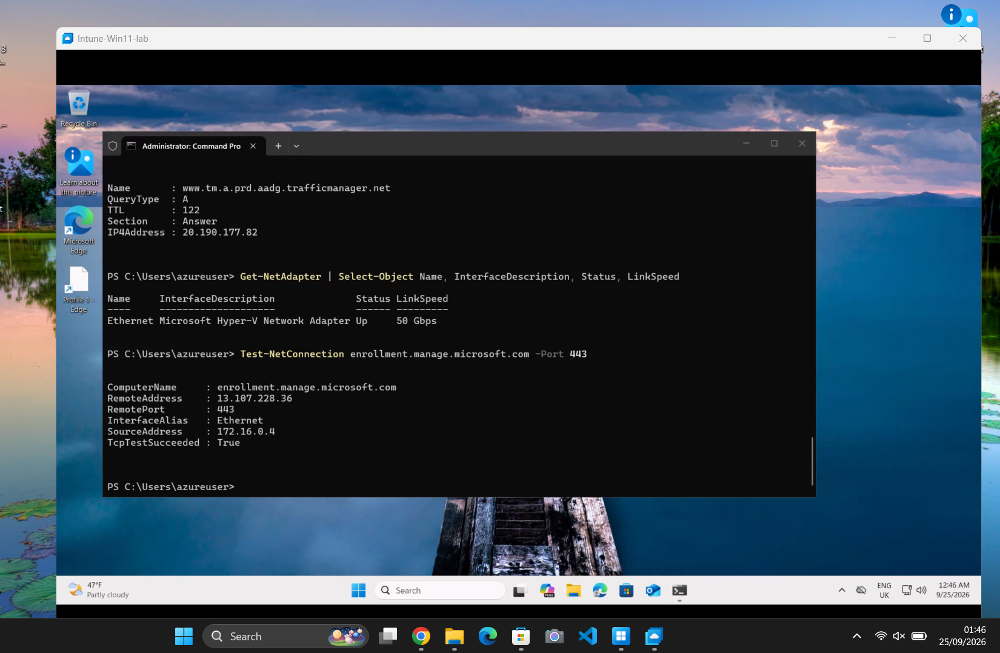

The result showed:

```text
RemotePort       : 443
TcpTestSucceeded : True
```

What I learned: The connection test worked, so I knew the VM could reach the Intune service. I then continued checking the Intune licence and account.

9. Intune Licence and Account Review

I checked the Microsoft account and found that the account was still under review.

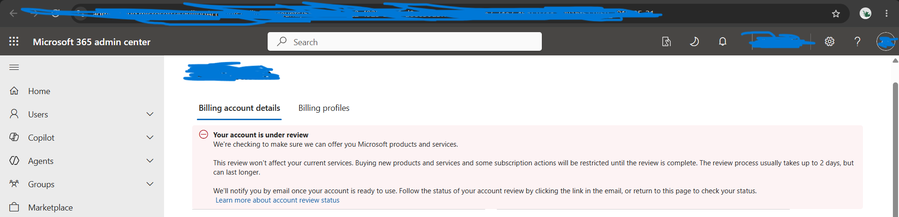

I stopped changing settings because the Intune licence was still not available.

What I learned: Azure credit and an Intune licence are separate. Having Azure credit does not automatically give me Intune.

10. Day 2 Outcome

By the end of Day 2 I had:

- Created and checked the Azure Windows test VM
- Worked through the RDP connection problems
- Started learning PowerShell commands
- Checked the VM system information
- Checked the IP, gateway and DNS settings
- Checked the network adapter
- Tested Microsoft sign-in connectivity
- Tested DNS resolution
- Connected the work account
- Attempted Intune enrollment
- Recorded the MDM discovery error
- Tested the Intune enrollment connection on port 443
- Found that the Microsoft account/licence review was still the blocker

Day 2 Status

Azure VM: Operational  
RDP: Working  
PowerShell practice: Completed  
Microsoft connectivity: Working  
Work account: Connected  
Intune enrollment: Pending  
Microsoft account/licensing review: Pending
