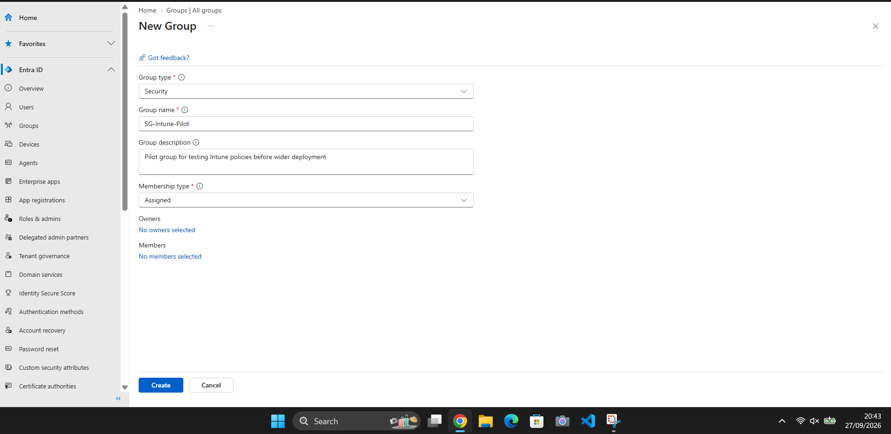
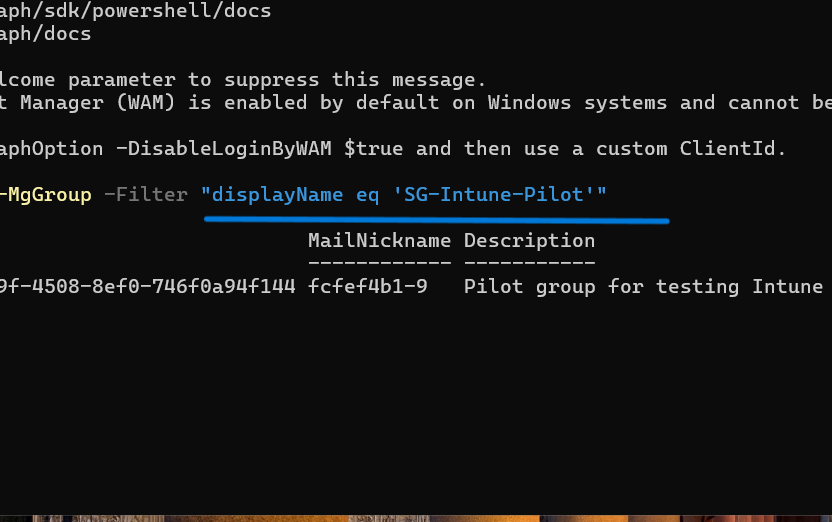
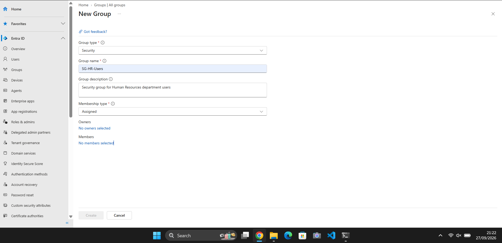
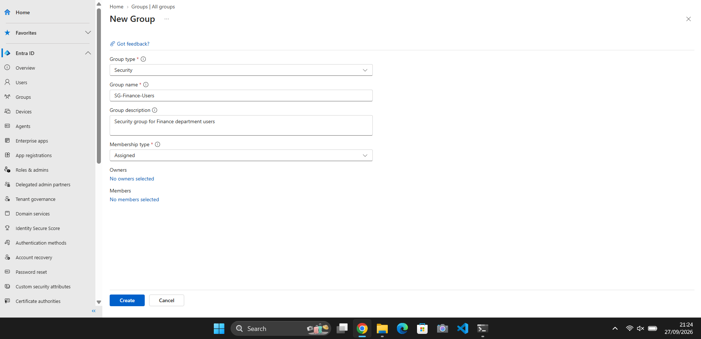
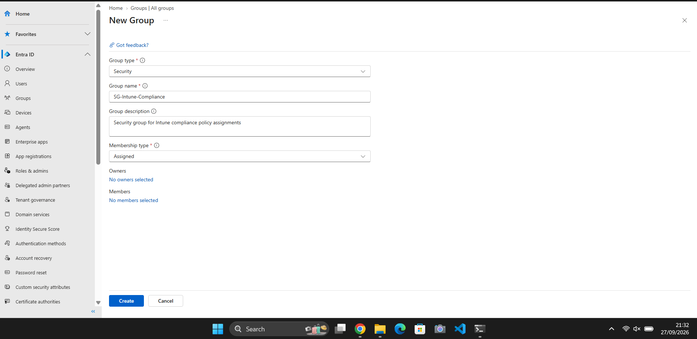
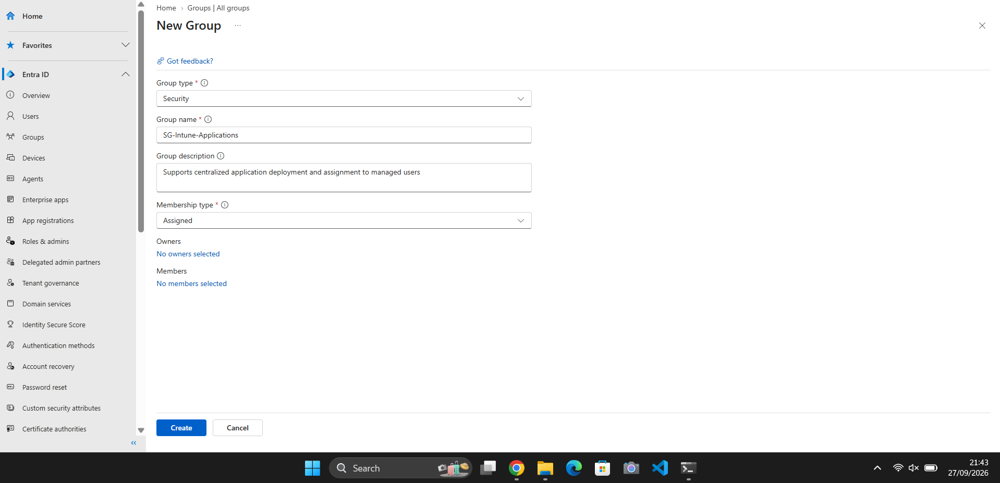
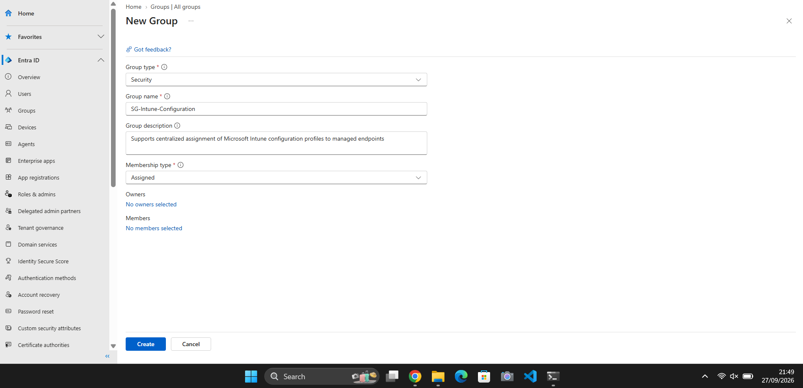
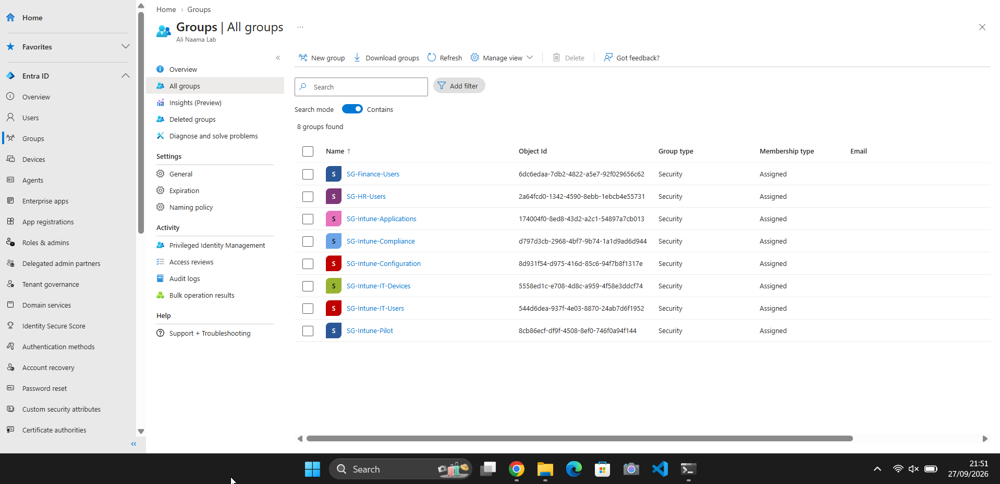
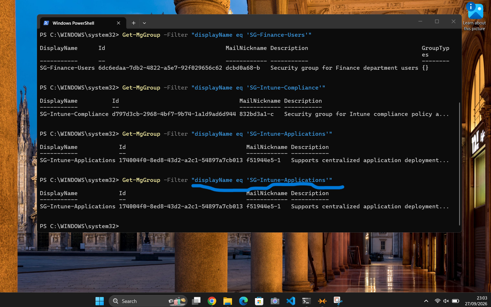

<h1>Day 4 – Microsoft Entra ID Group Management</h1>

<h2>Overview</h2>

Day 4 focused on building a structured Microsoft Entra ID security-group model for Microsoft Intune administration. The objective was to create logical assignment targets for users, devices, pilot testing, compliance, applications, configuration profiles and departmental requirements.

Using security groups instead of assigning settings directly to individual accounts or endpoints provides a more scalable administration model. The groups created during this stage are intended to support later Intune policy, application and device-management assignments.

The configuration was completed through the Microsoft Entra admin centre and validated with Microsoft Graph PowerShell.

---

<h2>Objectives</h2>

- Create dedicated security groups for Intune administration
- Separate user and device targeting
- Establish a controlled pilot group for testing
- Create departmental groups for HR and Finance
- Prepare dedicated targets for compliance, applications and configuration
- Verify the group structure using Microsoft Graph PowerShell
- Build a reusable structure for later Intune assignments

---

<h2>Pilot Deployment Group</h2>

**Group:** `SG-Intune-Pilot`

The pilot group provides a controlled target for testing new Intune configurations before wider deployment. In an operational environment, a pilot group can reduce deployment risk by allowing administrators to validate changes with a limited set of users or devices first.



The group was also verified through Microsoft Graph PowerShell:

```powershell
Get-MgGroup -Filter "displayName eq 'SG-Intune-Pilot'"
```



---

<h2>Departmental Security Groups</h2>

Department-based groups were created to demonstrate logical user organisation within Microsoft Entra ID.

**Groups created:**

- `SG-HR-Users`
- `SG-Finance-Users`

These groups provide potential assignment targets for department-specific applications, settings and access requirements.





---

<h2>Compliance Policy Targeting</h2>

**Group:** `SG-Intune-Compliance`

This group was created as a dedicated assignment target for future Microsoft Intune compliance policies. Compliance policies can evaluate whether managed devices meet defined organisational requirements before access decisions are made.



---

<h2>Application Deployment Targeting</h2>

**Group:** `SG-Intune-Applications`

This group provides a dedicated target for future application assignments through Microsoft Intune. Applications can later be configured as required or available for selected users or managed devices.



---

<h2>Configuration Profile Targeting</h2>

**Group:** `SG-Intune-Configuration`

This group was created to provide a controlled target for future Intune configuration profiles. Configuration profiles can centrally apply Windows settings, restrictions and endpoint configuration requirements.



---

<h2>Completed Group Structure</h2>

The completed lab structure includes the following security groups:

- `SG-Intune-IT-Users`
- `SG-Intune-IT-Devices`
- `SG-Intune-Pilot`
- `SG-Intune-Compliance`
- `SG-Intune-Applications`
- `SG-Intune-Configuration`
- `SG-HR-Users`
- `SG-Finance-Users`

Together, these groups establish separate targeting boundaries for administrative testing, users, devices, departmental requirements and future Intune workloads.



---

<h2>Microsoft Graph PowerShell Verification</h2>

Microsoft Graph PowerShell was used as a second verification method rather than relying only on the graphical portal.

The Graph session used group permissions:

```powershell
Connect-MgGraph -Scopes "Group.ReadWrite.All"
```

Individual groups were queried with commands such as:

```powershell
Get-MgGroup -Filter "displayName eq 'SG-Intune-Pilot'"
Get-MgGroup -Filter "displayName eq 'SG-HR-Users'"
Get-MgGroup -Filter "displayName eq 'SG-Finance-Users'"
Get-MgGroup -Filter "displayName eq 'SG-Intune-Compliance'"
Get-MgGroup -Filter "displayName eq 'SG-Intune-Applications'"
Get-MgGroup -Filter "displayName eq 'SG-Intune-Configuration'"
```

The final PowerShell verification confirmed that the required security groups were present in Microsoft Entra ID.



---

<h2>Skills Demonstrated</h2>

- Microsoft Entra ID administration
- Security-group design and management
- Intune assignment planning
- User and device targeting
- Pilot deployment methodology
- Department-based group organisation
- Microsoft Graph PowerShell
- Graph permission scopes
- PowerShell-based configuration verification
- Endpoint-management planning

---

<h2>Outcome</h2>

Day 4 established the Microsoft Entra ID group structure required for the next stages of the endpoint-management lab.

The environment now has dedicated security groups for IT users, IT devices, pilot testing, compliance, application deployment, configuration profiles and departmental targeting.

No Intune policies or applications were deployed during this stage. These groups were intentionally prepared as assignment targets for later lab activities, allowing future configurations to be introduced in a controlled and auditable way.

---

<h2>References</h2>

- Microsoft Learn – Manage Microsoft Entra groups: https://learn.microsoft.com/en-us/entra/fundamentals/how-to-manage-groups
- Microsoft Learn – Assign apps to groups with Microsoft Intune: https://learn.microsoft.com/en-us/intune/intune-service/apps/apps-deploy
- Microsoft Learn – Microsoft Graph PowerShell overview: https://learn.microsoft.com/en-us/powershell/microsoftgraph/overview
