<h1>Day 5 – Microsoft Intune Licensing and Enrollment Readiness</h1>

<h2>Objective</h2>

The objective of Day 5 was to activate Microsoft Intune licensing, establish a controlled pilot deployment model, verify the Intune tenant configuration, and assess Windows device enrollment readiness before enrolling test devices.

<h2>Microsoft Intune Plan 1 Activation</h2>

Microsoft Intune Plan 1 was successfully activated within the Microsoft 365 tenant.

The subscription provides **25 Intune Plan 1 licences**, allowing the lab environment to progress from Microsoft Entra device and identity preparation into endpoint management.

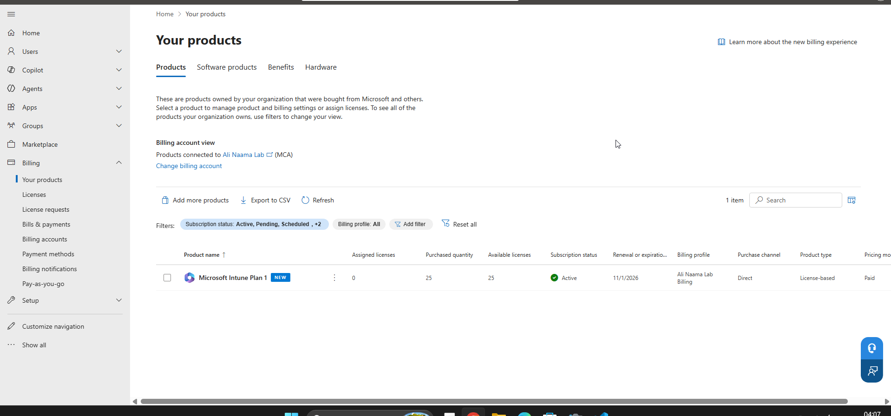

The licence pool was verified before beginning user assignment.

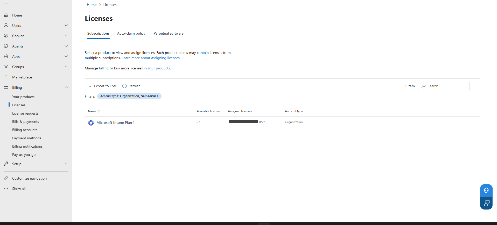

<h2>Pilot Deployment Group</h2>

The existing security group `SG-Intune-Pilot` was selected as the controlled pilot group for the initial Intune deployment.

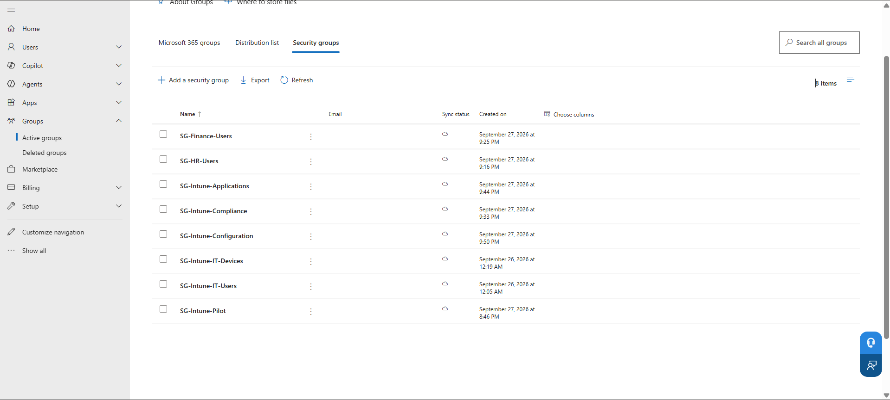

Using a dedicated pilot group allows new Intune configurations to be tested against a limited set of users before broader deployment. This reduces the risk of applying untested policies across the wider environment.

The initial pilot membership was reviewed before a test user was added.

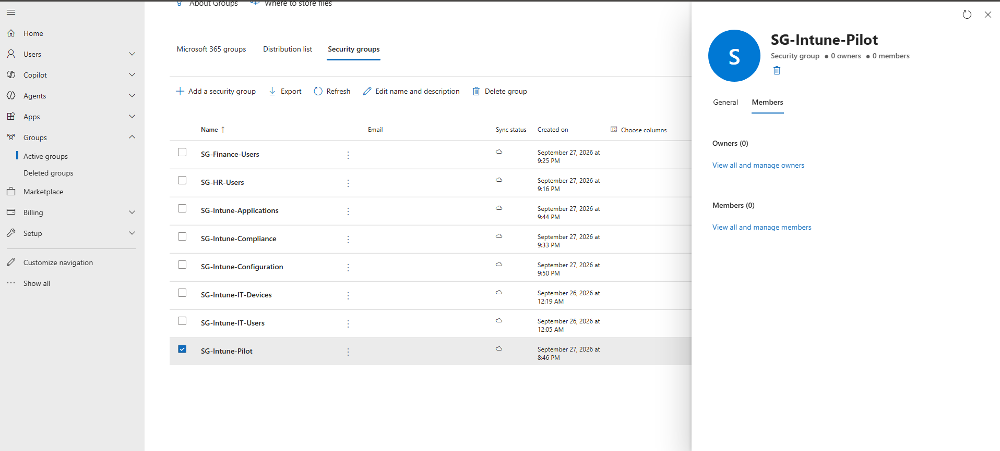

The required test user was then selected for membership.

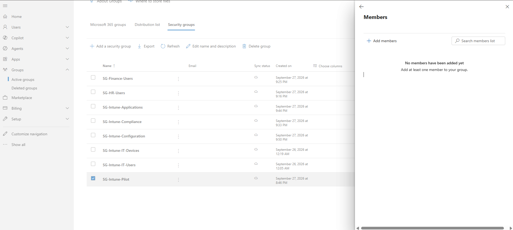

The completed membership was verified in the pilot group.

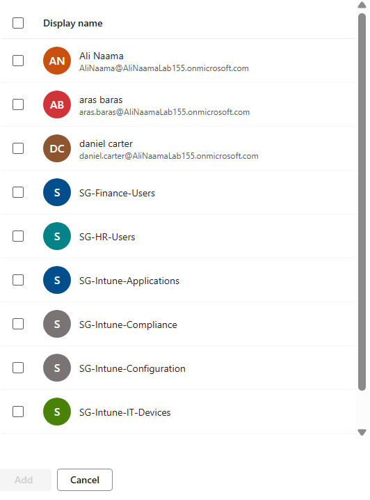

<h2>Group-Based Intune Licensing</h2>

Before assignment, the available licensing state was reviewed in Microsoft Entra.

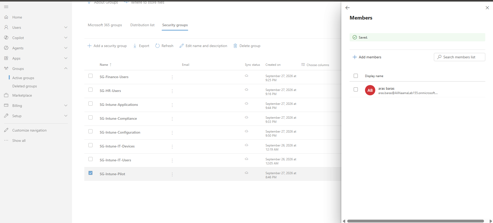

Microsoft Intune Plan 1 was assigned to `SG-Intune-Pilot` rather than directly assigning the licence to individual users.

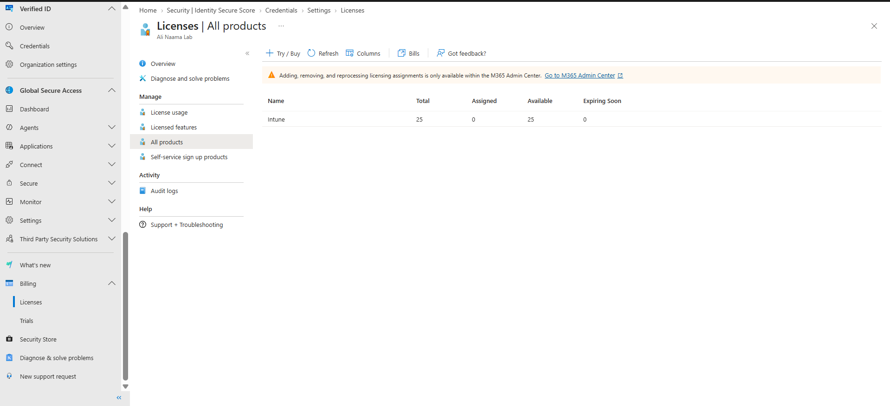

The assignment process was allowed to complete and propagate.

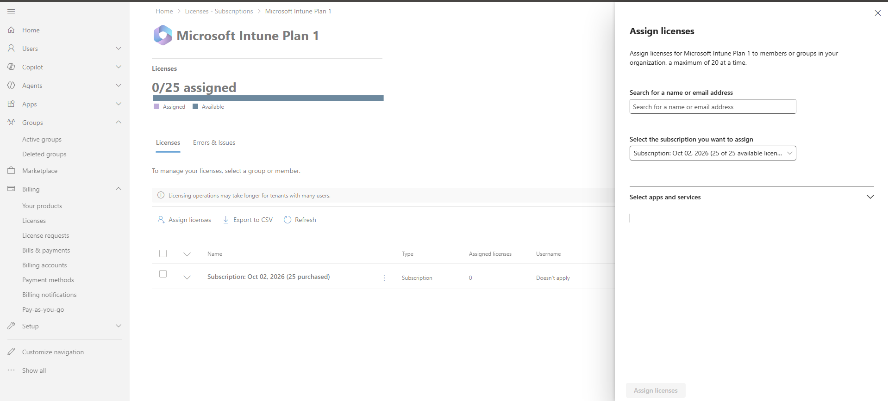

The resulting structure is:

`Microsoft Intune Plan 1 → SG-Intune-Pilot → Pilot User`

The completed group-based assignment was then confirmed.

Following the assignment, the Microsoft 365 Admin Center reported **25 total Intune licences**, **1 assigned**, and **24 available**.

This provides a scalable licensing model because appropriate users can be added to the pilot group instead of requiring individual licence assignment.

<h2>Intune Tenant Validation</h2>

After licensing was completed, the Microsoft Intune Admin Center was accessed to confirm that the service had become operational.

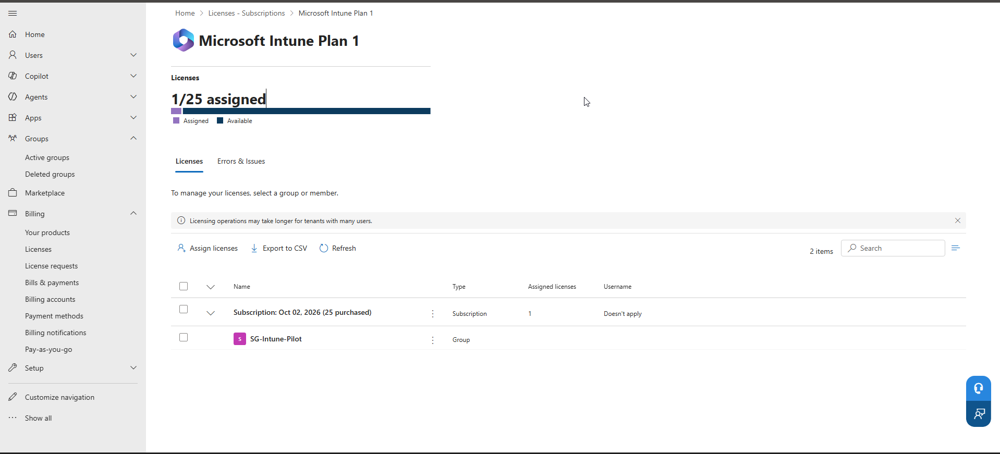

Tenant Status confirmed:

- **Account status:** Active
- **MDM authority:** Microsoft Intune
- **Total Intune licences:** 25
- **Licensed users:** 1
- **Enrolled devices:** 0

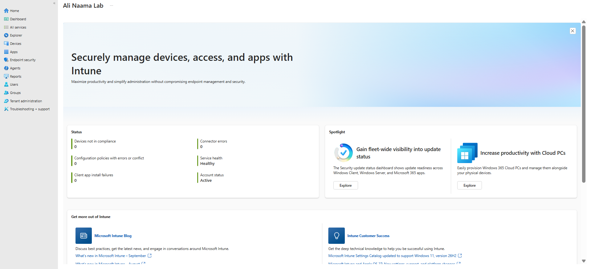

This confirmed that Intune licensing had propagated successfully and that the tenant was ready for endpoint-management configuration.

<h2>Windows Enrollment Readiness</h2>

The Devices overview was checked before enrollment and confirmed that no devices had yet been enrolled into Intune.

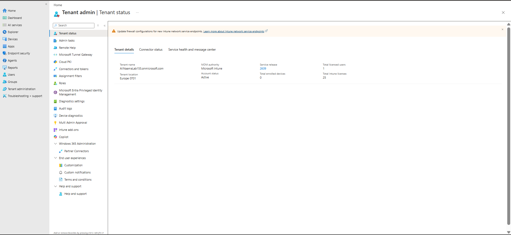

Windows enrollment settings were then reviewed under `Devices → Enrollment → Windows`.

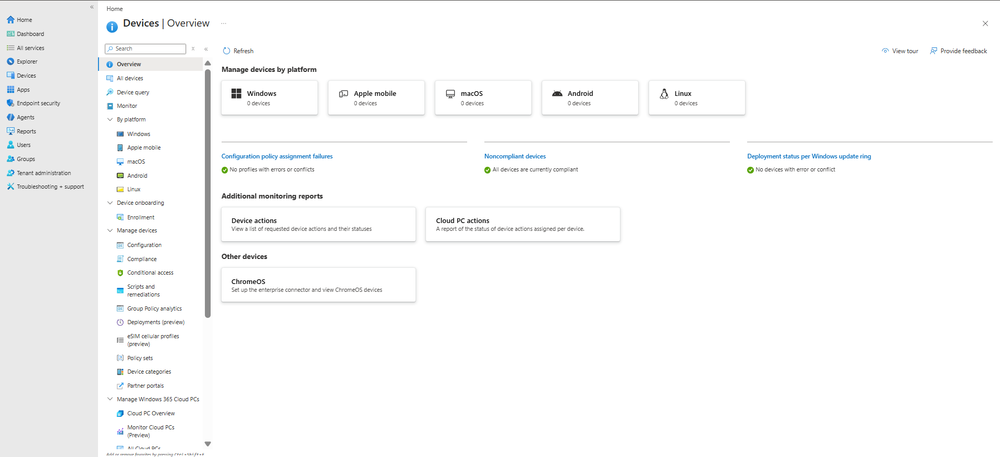

The available Windows enrollment capabilities were examined before attempting to enroll the Windows 11 lab device. At this stage, no device was enrolled because the enrollment configuration was being validated first.

<h2>Automatic MDM Enrollment</h2>

Automatic MDM enrollment was investigated as the preferred method for automatically enrolling eligible Microsoft Entra users and Windows devices into Intune.

The tenant reported that **Automatic MDM Enrollment requires Microsoft Entra ID Premium**.

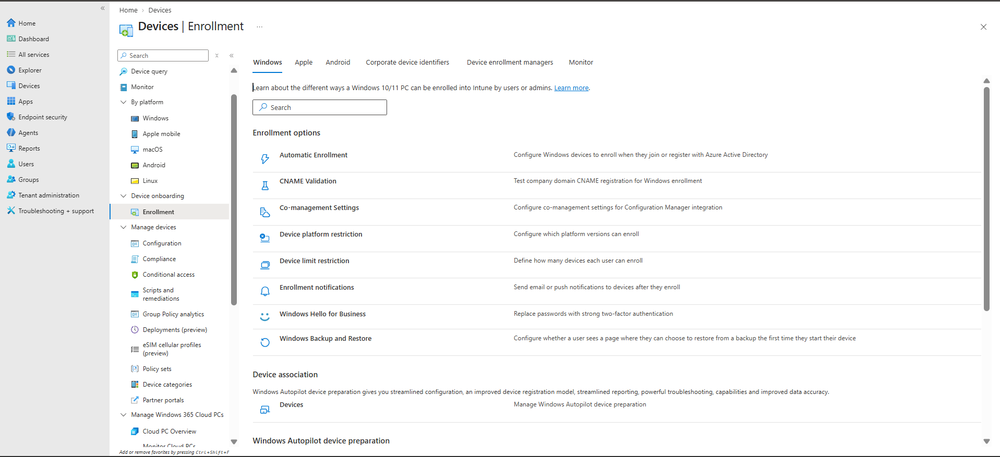

Because the current lab licensing does not provide the required Entra ID Premium capability, the automatic enrollment configuration was not changed. This limitation was documented so the lab accurately reflects the licensing dependencies involved in an Intune deployment.

The Intune Plan 1 assignment itself was also verified as successfully applied.

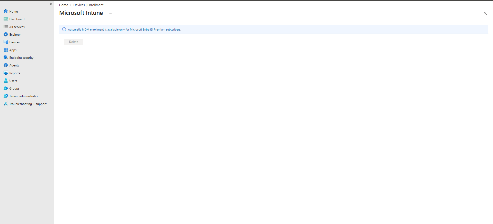

<h2>Day 5 Outcome</h2>

Day 5 established the licensing and tenant foundation required for endpoint management.

Microsoft Intune Plan 1 is active, pilot-based licensing is operational, the tenant recognises Microsoft Intune as its MDM authority, and Windows enrollment capabilities have been assessed.

No PowerShell automation was introduced during this stage because the focus was establishing and validating the Intune service through the administrative portals.

<h2>Next Steps</h2>

Day 6 will focus on **Windows device enrollment**.

The Windows 11 lab device will be enrolled into Microsoft Intune and its management state verified through the Intune Admin Center. Once managed devices are available, later stages can introduce Microsoft Graph and PowerShell for querying and administering the Intune environment.

<h2>References</h2>

- [Microsoft Intune documentation](https://learn.microsoft.com/intune/intune-service/)
- [Microsoft Intune licensing](https://learn.microsoft.com/intune/intune-service/fundamentals/licenses)
- [Windows enrollment in Microsoft Intune](https://learn.microsoft.com/intune/intune-service/enrollment/windows-enrollment-methods)
- [Automatic enrollment for Windows](https://learn.microsoft.com/intune/intune-service/enrollment/windows-enroll)
